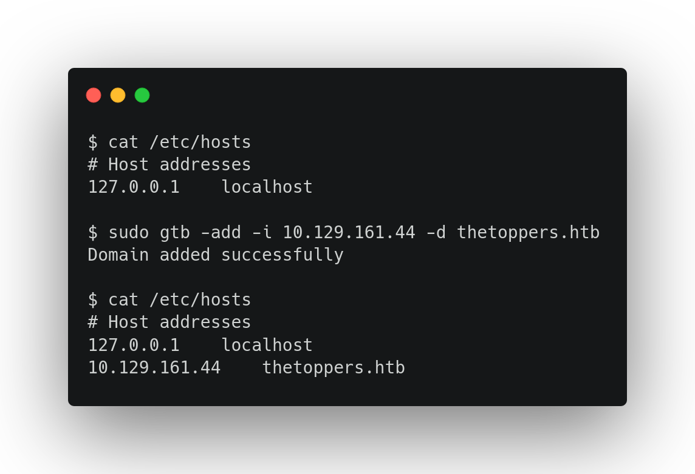

<h1 align="center">
  
  <br>
</h1>

<p align="center">
  <a href="#installation">Installation</a> •
  <a href="#usage">Usage</a> •
  <a href="#running-gtb">Running gtb</a> •
  <a href="#notes">Notes</a>
</p>

`gtb` is a "shortcut" to adding, removing or replacing hosts in /etc/hosts file. Made for \*nix, but hypothetically can work with Windows hosts file (c:\Windows\System32\Drivers\etc\hosts). **You need root privileges to edit /etc/hosts, so run the tool as root or with sudo.**

# Installation

```sh
go install -v github.com/tokiakasu/go-to-box/cmd/gtb@latest
```

# Usage

```sh
gtb -h
```

This will display help for the tool. 

```console
Add, remove or replace hosts in the hosts file
Usage: gtb { mode } { argument(s) } 
-rm	Mode to remove all domains with a specified TLD
-add	Mode to add host to hosts file
-re	Mode to remove all domains with specific TLD to replace them wtih another IP and domain
-i	Value for domain IP address
-d	Value for domain name

There are only 3 types of program execution scenarios:
gtb -rm <tld>                                Remove all <tld> domains from hosts file
gtb -add -i <IP> -d <domain>                 Add <IP> address and <domain>
gtb -re -i -rm <tld> -i <IP> -d <domain>     Remove all <tld> domains and add <IP> with <domain>
```

# Running gtb

### Remove all domains with specified TLD

`/etc/hosts` before

```console
# Host addresses
127.0.0.1    localhost
10.129.162.54    therockers.com
10.120.143.99    thecreators.com
10.129.161.44    thetoppers.htb
```

This will delete all .com domains

```console
# gtb -rm com

Domains removed successfully
```

`/etc/hosts` after 

```console
# Host addresses
127.0.0.1    localhost
10.129.161.44    thetoppers.htb
```

### Add new IP address and domain name

`/etc/hosts` before

```console
# Host addresses
127.0.0.1    localhost
10.129.162.54    therockers.com
```

This will add the IP address `10.129.161.44` and the domain name `thetoppers.htb` at the end of the hosts file

```console
# gtb -add -i 10.129.161.44 -d thetoppers.htb

Domain added successfully
```

`/etc/hosts` after

```console
# Host addresses
127.0.0.1    localhost
10.129.162.54    therockers.com
10.129.161.44    thetoppers.htb
```

### Replace old domains with new ones

`/etc/hosts` before

```console
# Host addresses
127.0.0.1    localhost
10.129.162.54    therockers.htb
10.120.143.99    thecreators.htb
10.129.161.44    thetoppers.htb
```

This will remove all .htb domains and add the IP address `192.168.0.50` with domain name `ftp.localx.com` at the end of the hosts file

```console
# gtb -re -rm htb -i 192.168.0.50 -d ftp.localx.com

Domain replaced successfully
```

`/etc/hosts` after

```console
# Host addresses
127.0.0.1    localhost
192.168.0.50    ftp.localx.com
```

# Notes

- gtb works with only one TLD, IP address or domain name at a time
- The path to the hosts file is set in hostsPath variable within main() function. Feel free to change it.
- To be honest, writing this tool by using only internals libs, especially `flag` library was a real ~pain~ challenge. 
